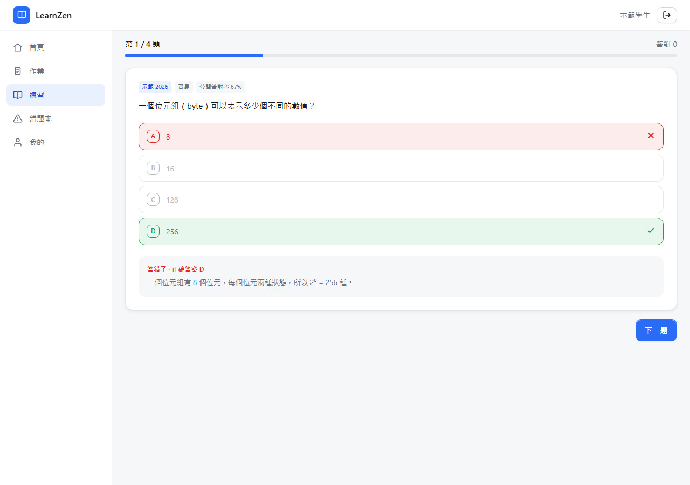
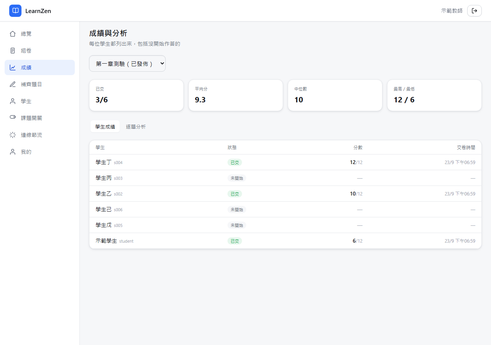
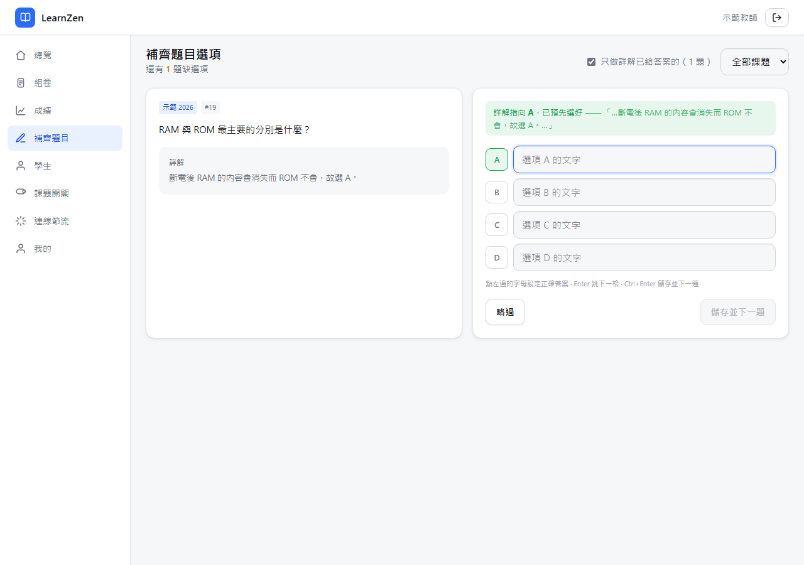
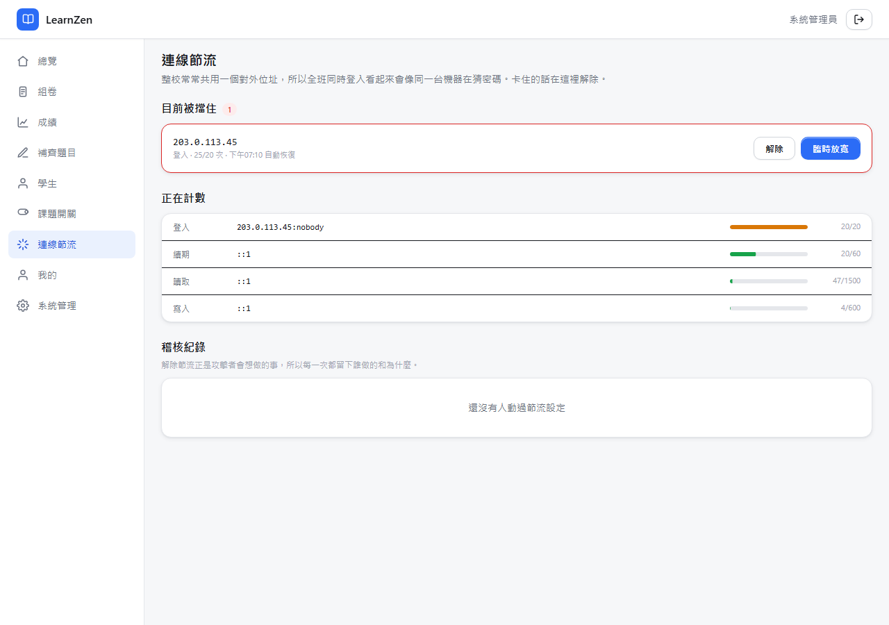
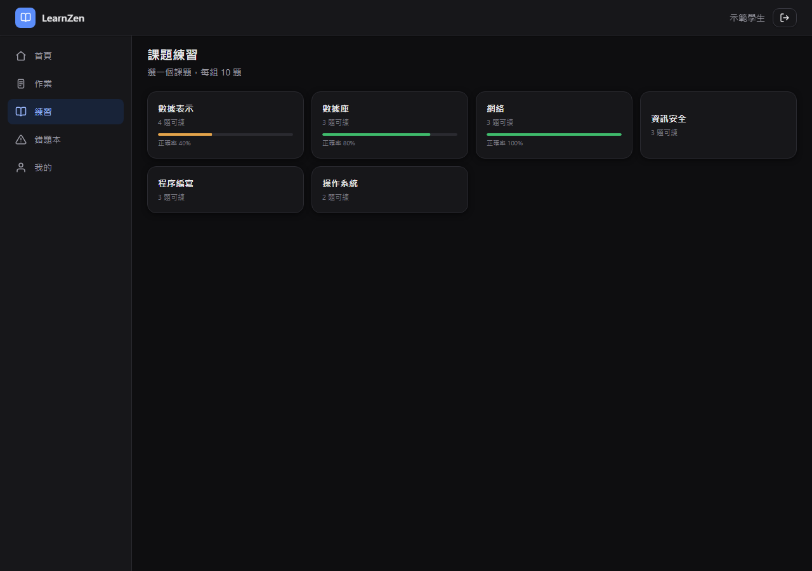
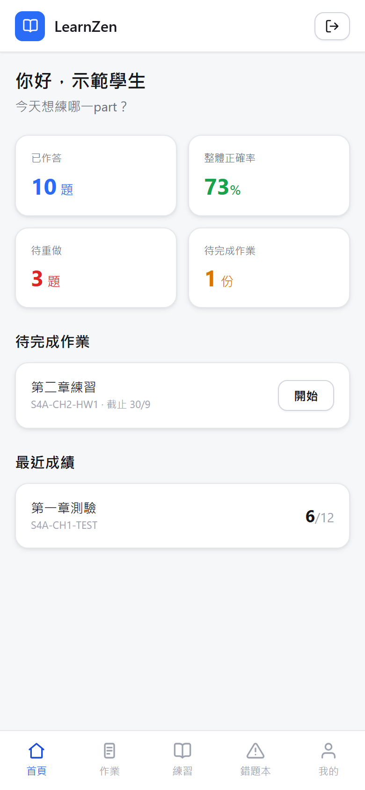

# LearnZen

HKDSE ICT 練習平台：課題練習、錯題本、作業與測驗、教師出卷與成績分析。
後端零第三方相依（Node 24 內建 `node:sqlite`），前端 Vue 3。

這是把我原本在用的一套學習平台重寫一遍的結果。下面「設計決定」那一節逐條說明
每個決定要解決什麼問題——那些是實際踩過的坑，不是假想的。

## 畫面

<table>
<tr>
<td width="50%"></td>
<td width="50%"></td>
</tr>
<tr>
<td><b>課題練習</b>——答對的選項轉綠、選錯的轉紅、其餘用停用色壓掉，詳解隨後展開。作答前伺服器不會送出任何答案鍵。</td>
<td><b>成績</b>——每位學生都列出來，包括沒開始作答的。沒交就是 <code>—</code> 不是 0：「沒交」和「交了考零分」是兩回事。</td>
</tr>
<tr>
<td></td>
<td></td>
</tr>
<tr>
<td><b>補齊題目</b>——缺選項的題目是 <code>DRAFT</code>，永遠不會派給學生。詳解若寫了「故選 C」會預先選好並附上依據，讓人一眼能否決它。</td>
<td><b>連線節流</b>——整校共用一個對外位址，全班同時登入會像同一台機器在猜密碼。教師可以解除或臨時放寬，管理員才能收緊，每一次都寫進稽核紀錄。</td>
</tr>
<tr>
<td></td>
<td></td>
</tr>
<tr>
<td><b>深色主題</b>——層級改用「越高的表面越亮」表達，因為黑影投在近黑背景上看不見。切換換的是機制，不只是色票。</td>
<td><b>手機版</b>——底部導覽、安全區域留白。</td>
</tr>
</table>

截圖由 `scripts/shoot.mjs` 從 `scripts/demo.mjs` 產生的示範資料拍攝，題目是為此寫的，
人物是虛構的。要自己重現：

```bash
node scripts/demo.mjs                                  # data/demo.db
LB_DB=data/demo.db PORT=8788 LB_TRUST_PROXY=1 npm start &
node scripts/shoot.mjs http://localhost:8788 --out docs/screenshots
```

## 跑起來

```bash
node scripts/seed.mjs                       # 課題、班別、三個帳號
node scripts/demo.mjs                       # 或：連同示範題目與作答記錄
node scripts/import-questions.mjs <匯出檔…>  # 灌題庫，可重複執行
cd web && npm install && npm run build      # 前端
npm start                                   # http://localhost:8787
```

開發時前後端分開跑：`npm run dev`（API，8787）＋ `cd web && npm run dev`（Vite，5173，已設 `/api` proxy）。

預設帳號：`student / student-1234`、`teacher / teacher-1234`、`admin / admin-1234`。

```bash
npm test            # 177 個測試
LB_ROUTES=1 npm start   # 啟動時印出完整路由與權限對照表
```

## 設計決定

重寫的動機是幾類反覆出現的 bug。每一條都對應到一個結構上的決定，而不是補丁。

### 分數只有伺服器能算

我遇過的做法是由瀏覽器回報答對幾題（`?correctCount=…`），伺服器照單全收。

這裡評分只發生在 `server/scoring.js`，路由不准自己比對答案。客戶端送 `{"score": 999}` 進交卷端點會被完全忽略——有測試釘住。

### 錯題本是一張表，不是一個查詢

`wrong_book` 的主鍵是 `(user_id, question_id)`，所以同一題不可能出現兩次。
維護它的只有 `recordAttempt()` 一個入口。規則：答錯就進去（先前清除過的會重新開啟），**連續答對兩次**才清除，清除後保留列以區分「清掉了」和「從沒錯過」。重複交卷不會重複計數。

### 身分只來自 token

常見的做法是每支學生端 API 都收一個 `studentId` 參數。這裡沒有任何路由接受呼叫端指定身分，一律用 `ctx.user.id`。

權限有兩道獨立的閘，都要過：

1. **角色權限**——每條路由必須宣告權限字串，`route()` 在註冊時就檢查它在不在 `rbac.js` 的目錄裡，不在就讓行程啟動失敗。要豁免得明寫 `PUBLIC`。
2. **資料歸屬**——老師有 `student.profile.read` 不代表能讀任何學生，只能讀他帶的班的學生。每次跨人存取都經過 `assertTeachesClass` / `assertCanReadStudent` / `loadAssignmentFor`。

### 列的形狀不隨狀態改變

我遇過的作業列表在 `pending` 狀態下少了 `score`、`submittedAt`、`recordStatus` 三個鍵，前端讀到 `undefined`，於是 `score/maxScore` 變 `NaN`、`dayjs(undefined)` 變成今天——整張表看起來就壞了。

這裡每個作業列的鍵組合恆定，所有跟學生有關的欄位收在 `submission` 底下，**要嘛是 `null`，要嘛欄位齊全**。資料庫層也擋死：

```sql
CHECK ((status = 'SUBMITTED') = (submitted_at IS NOT NULL)),
CHECK ((status = 'SUBMITTED') = (score IS NOT NULL))
```

未提交卻有分數，或已提交卻沒分數，寫不進去。

### 時間一律是 epoch 毫秒

一個沒有時區的時間字串 `"2026-09-29T05:08:00"`：同一個字串在 +08 的機器解析成 `1790629680000`，在 UTC 的機器解析成 `1790658480000`——**差 8 小時**。

而且 `null` 時間戳被拿去比大小時會變成 1970：`new Date(null) >= Date.now()` 讓「答案是否可公開」恆為真。這裡公開規則是列舉 `NEVER | AFTER_SUBMIT | AFTER_DUE | AT_TIME`，每條都明確要求對應的時間戳非空。

### 節流，而不是鎖帳號

我第一版寫了「連錯 8 次鎖 15 分鐘」，但那本身就是攻擊面：**知道你帳號名稱的人可以隨時把你鎖在外面，而你無法自救。**

改成 rate limit（`server/ratelimit.js`），關鍵在計數的鍵：

| 鍵 | 窗口 / 上限 | 擋什麼 |
|---|---|---|
| 來源位址 | 15 分 / 20 次 | 從一個地方亂試 |
| 來源位址 **+** 帳號 | 15 分 / 8 次 | 從一個地方猛攻一個帳號 |
| refresh | 5 分 / 60 次 | 失控的客戶端 |
| 改密碼 | 15 分 / 10 次 | 猜舊密碼 |
| 一般寫入 / 讀取 | 5 分 / 600、1500 次 | 洪水 |

**從不單用帳號當鍵。** 所以 A 把某個帳號打到 429，換個位置照樣登得進去——這正是鎖帳號做不到的。計數在記憶體、自己過期，靠等就會恢復，不需要人去解鎖。登入成功會退還額度，打錯兩次再打對的人不會愈來愈接近被擋。

節流發生在路由比對**之前**，所以打不存在的路徑一樣被計數，不能拿來繞過。`X-Forwarded-For` 只在 `LB_TRUST_PROXY=1` 時才採信——否則任何人都能自己偽造一個新桶。

（單一行程持有全部計數。要跑多個行程就得改成共用儲存，否則上限會變成每個行程各一份。）

### 掉線不會丟東西

- 作答中的答案逐題存草稿，重整回來原樣還在。
- 練習 session 保存它的題目清單（`practice_session_questions`），重整回到同一組題、同一個順序、同一個進度；已答的題才看得到答案，沒答的不准偷看。
- access token 只在記憶體，15 分鐘；refresh token 在 httpOnly、`SameSite=Strict`、限定 `/api/auth` 的 cookie 裡，輪替發放並偵測重放。
- 前端 401 自動續期並重送，**併發請求共用同一次續期**——否則五個請求同時 401 會觸發五次輪替，被伺服器判定為 token 重放而把人踢掉。

### 沒有答案的題目不會被派出去

匯入時缺選項或缺正確答案的題目一律存成 `DRAFT`。練習選題、出卷都要求題目有答案鍵，所以不會發生「答完才說無法評分」。

### 課題開關預設是開

新課題預設關閉、學生點進去才被告知「此課題已被教師關閉」是很糟的預設。這裡沒有明確關過就是開的，而且教師端分得出「預設開」和「老師真的設過」。

## 題庫

倉庫**不含題庫**。`scripts/import-questions.mjs` 吃任意數量的 JSON 檔，用題號合併，
後面的檔案補前面缺的欄位，可重複執行：

```bash
node scripts/import-questions.mjs a.json b.json --dry-run   # 先看合併結果
node scripts/import-questions.mjs a.json b.json
```

它接受的形狀很寬鬆（`{data:[…]}`、`{questions:[…]}`、或直接一個陣列），欄位名
`contentZh` / `content`、`explanationZh` / `explanation` 都認得。HTML 實體會在匯入時還原。

**缺選項或缺正確答案的題目一律存成 `DRAFT`，永遠不會派給學生**；教師端的
「補齊題目」頁可以逐題補上，詳解裡若寫了「故選 C」會自動預選並附上依據。

## 結構

```
server/
  schema.sql     17 張表，矛盾狀態用 CHECK 擋死
  db.js          node:sqlite 封裝與交易
  scoring.js     唯一的評分與錯題本入口
  auth.js        scrypt、access token、輪替式 refresh
  rbac.js        權限目錄與歸屬驗證
  http.js        路由器（沒宣告權限就註冊不了）＋ 節流入口
  ratelimit.js   來源位址節流，取代帳號鎖定
  serialize.js   出牆的資料形狀，答案鍵要明確要求才給
  routes/        auth / practice / assignments / teacher
web/             Vue 3 + Vite + Tailwind 4 + motion-v
scripts/         seed、匯入、匯出
test/            177 個測試
```
